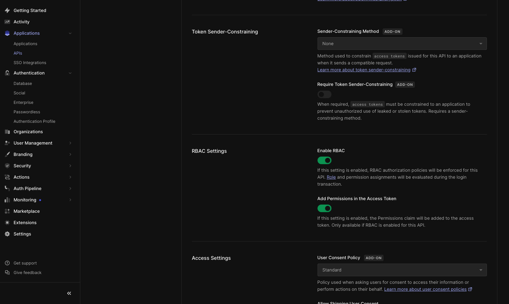
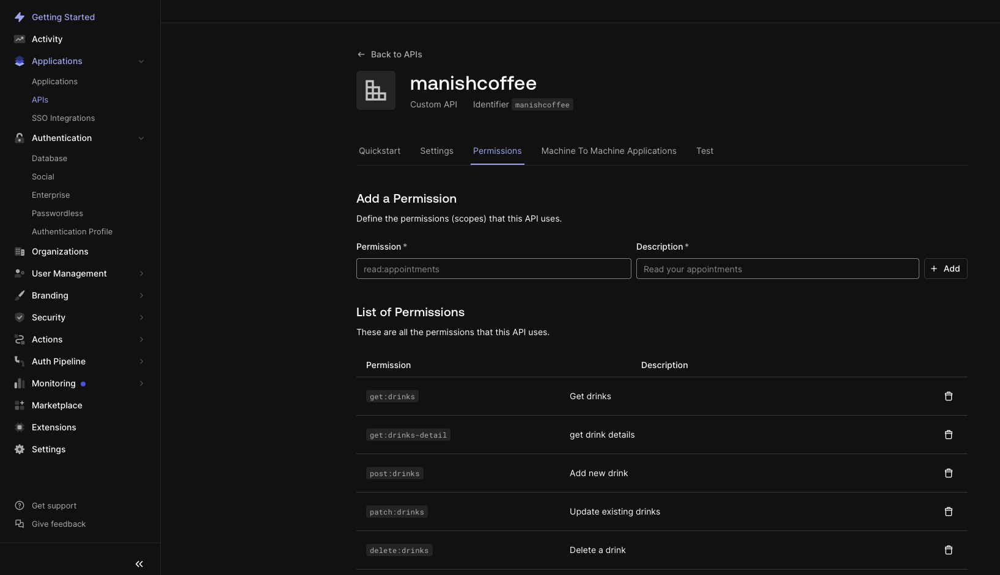
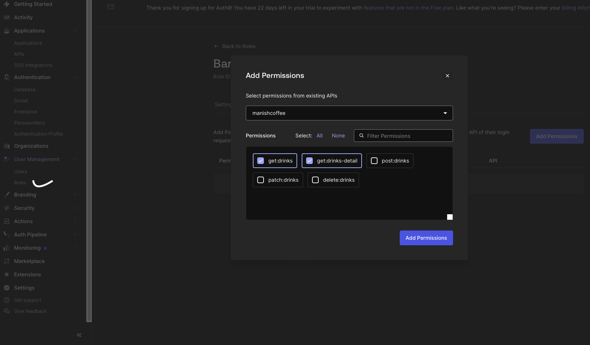
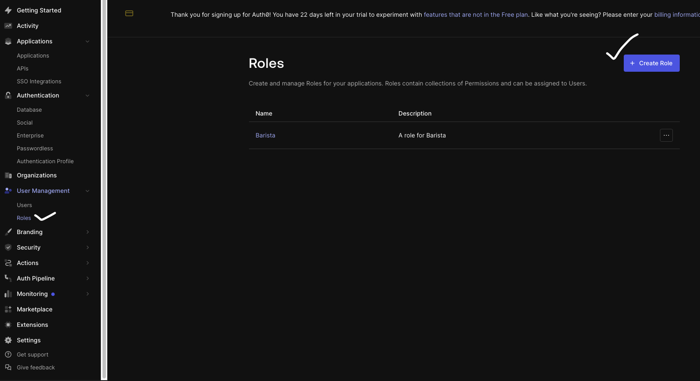
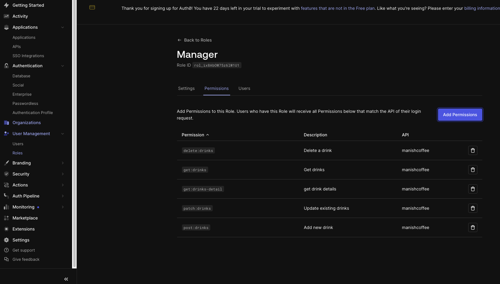
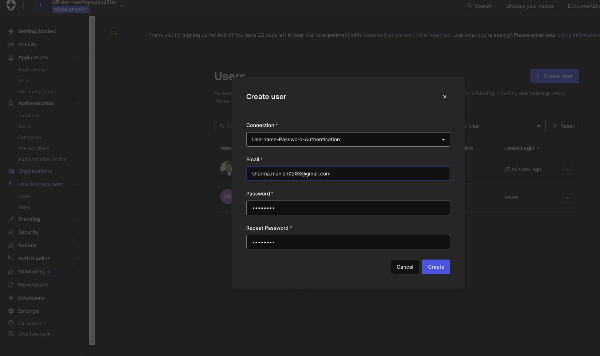
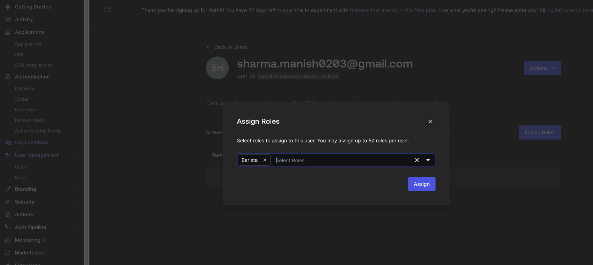
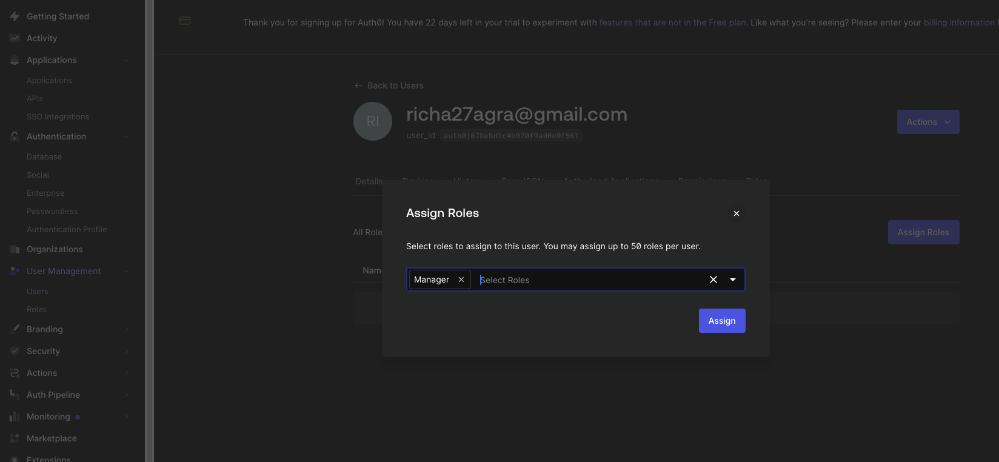

# Coffee Shop Backend

## Getting Started

### Installing Dependencies

#### Python 3.7

Follow instructions to install the latest version of python for your platform in the [python docs](https://docs.python.org/3/using/unix.html#getting-and-installing-the-latest-version-of-python)

#### Virtual Environment

We recommend working within a virtual environment whenever using Python for projects. This keeps your dependencies for each project separate and organized. Instructions for setting up a virtual environment for your platform can be found in the [python docs](https://packaging.python.org/guides/installing-using-pip-and-virtual-environments/)

#### PIP Dependencies

Once you have your virtual environment setup and running, install dependencies by naviging to the `/backend` directory and running:

```bash
pip install -r requirements.txt
```

This will install all of the required packages we selected within the `requirements.txt` file.

##### Key Dependencies

- [Flask](http://flask.pocoo.org/) is a lightweight backend microservices framework. Flask is required to handle requests and responses.

- [SQLAlchemy](https://www.sqlalchemy.org/) and [Flask-SQLAlchemy](https://flask-sqlalchemy.palletsprojects.com/en/2.x/) are libraries to handle the lightweight sqlite database. Since we want you to focus on auth, we handle the heavy lift for you in `./src/database/models.py`. We recommend skimming this code first so you know how to interface with the Drink model.

- [jose](https://python-jose.readthedocs.io/en/latest/) JavaScript Object Signing and Encryption for JWTs. Useful for encoding, decoding, and verifying JWTS.

## Running the server

From within the `./src` directory first ensure you are working using your created virtual environment.

Each time you open a new terminal session, run:

```bash
export FLASK_APP=api.py;
```

To run the server, execute:

```bash
flask run --reload
```

The `--reload` flag will detect file changes and restart the server automatically.

## Tasks

### Setup Auth0

1. Create a new Auth0 Account
2. Select a unique tenant domain
3. Create a new, single page web application
4. Create a new API
   - in API Settings:
     - Enable RBAC
     - Enable Add Permissions in the Access Token
     
5. Create new API permissions:
   - `get:drinks`
   - `get:drinks-detail`
   - `post:drinks`
   - `patch:drinks`
   - `delete:drinks`
   
6. Create new roles for:
   - Barista
     - can `get:drinks-detail`
     - can `get:drinks`
     
   - Manager
     - can perform all actions
     
     
7. Test your endpoints with [Postman](https://getpostman.com).
   - Register 2 users - assign the Barista role to one and Manager role to the other.
   
   
   
   - Sign into each account and make note of the JWT.

Barista User - 


Manager User - 


   - Import the postman collection `./starter_code/backend/udacity-fsnd-udaspicelatte.postman_collection.json`
     

   - Right-clicking the collection folder for barista and manager, navigate to the authorization tab, and including the JWT in the token field (you should have noted these JWTs).
   - Run the collection and correct any errors.
     
**Barista** user is able to access the GET endpoints - 
GET /drinks

GET /drinks-detail


But **Barista** user is NOT able to get POST, PATCH, and DELETE endpoints - 
POST /drinks

PATCH /drinks/1

DELETE /drinks/1


     
**Manager** user is able to access the endpoints - 
GET /drinks

GET /drinks-detail

POST /drinks

PATCH /drinks/1

DELETE /drinks/1


   - Export the collection overwriting the one we've included so that we have your proper JWTs during review!

### Implement The Server

There are `@TODO` comments throughout the `./backend/src`. We recommend tackling the files in order and from top to bottom:

1. `./src/auth/auth.py`
2. `./src/api.py`
